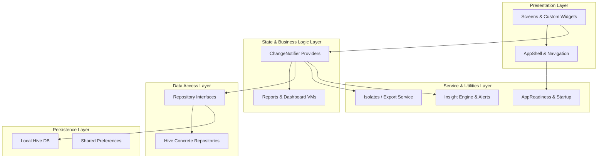
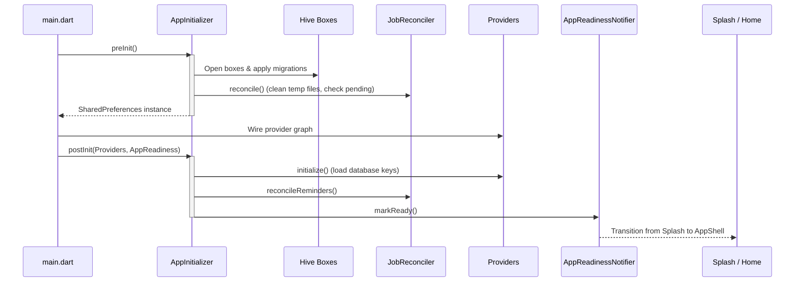

# Budgo — Professional Expense & Financial Management App

Budgo is an offline-first, high-performance personal finance and expense management application built using Flutter. It is designed to be visually stunning, highly performant, and structurally robust. The application employs state-of-the-art software engineering principles, Material 3 design system tokens, thread-safe asynchronous concurrency, and algorithmic optimizations to support a smooth, crash-free user experience over years of transaction history.

---

## 1. Architectural System Overview

Budgo implements a highly modular, decoupled layered architecture, separating concerns into discrete, single-responsibility boundaries.



### 1.1 Architectural Layers

1. **Presentation Layer (`lib/screens/`, `lib/widgets/`)**:
   - Composed of pure Flutter widgets structured using Material 3 specifications.
   - All UI widgets are consumption-only (subscribing to Providers) or stateless presentation modules. Forms are displayed dynamically as content-driven bottom sheets.
2. **State & Logic Layer (`lib/provider/`)**:
   - Manages state using the `Provider` library.
   - Uses `ProxyProvider` patterns to wire dependencies (e.g., injecting `ExpensesProvider` and `IncomeProvider` into `BudgetProvider` or `DashboardProvider`) to construct clean reactive graphs.
3. **Data Access Layer (`lib/repositories/`)**:
   - Implements the Repository Pattern, abstracting Hive boxes behind interfaces.
   - Decouples local storage engines from business logic, ensuring that database updates do not leak implementation details.
4. **Persistence Layer (`Hive`, `SharedPreferences`)**:
   - Uses **Hive** for high-speed, local NoSQL persistence.
   - Uses **SharedPreferences** for lightweight user preferences, themes, and notification metrics.
5. **Services/Utilities Layer (`lib/services/`, `lib/core/`)**:
   - Dedicated managers for heavy background processing: thread-isolated CSV/PDF compilation, alerts throttling, timezone-aware push notifications, database migrations, and job reconciliation.

---

## 2. Startup Bootstrapping & Crash Recovery

Budgo splits initialization into two distinct phases to guarantee a fast startup time and ensure that incomplete state writes are resolved before the UI loads.



- **Pre-Initialization Phase (`AppInitializer.preInit`)**:
  - Initializes Flutter bindings, Hive local directory, and registers adapters.
  - Opens database boxes using the `HiveMigration` safety engine.
  - Triggers the `JobReconciler` to perform file cleanup and recover incomplete processes.
- **Post-Initialization Phase (`AppInitializer.postInit`)**:
  - Automatically checks the `AppStateBox.isPendingReset` flag. If the app crashed during a destructive reset, a recovery script runs immediately to purge half-deleted databases.
  - Loads data into provider caches asynchronously, initialises timezone-aware push notifications, and marks `AppReadinessNotifier.ready = true` to fade out the `SplashScreen` and launch the `AppShell`.

---

## 3. High-Performance Algorithmic Optimizations

To handle **5+ years of continuous daily transaction records** without frames dropping, memory leaks, or crashes, Budgo integrates the following computer science optimization strategies:

### 3.1 Custom Sliding Window Pagination
Loading thousands of complex custom widgets in a standard scroll view causes high memory footprints and CPU overhead. Budgo implements a double-ended sliding viewport within the `ExpensesProvider`:
- Filters are applied on the full in-memory list.
- A sliding viewport limits the visible subset to `kExpenseWindowSize = 100` items.
- As the user scrolls, `ScrollController` triggers `advanceWindow()` and `retreatWindow()`, loading slices dynamically in $O(1)$ time and keeping widget trees compact.

### 3.2 Inverted Prefix Search Index
Traditional database search queries run $O(N)$ regex string searches over thousands of records, causing stutter. Budgo constructs an in-memory **Inverted Prefix Index** on data load:
- Product names and categories are tokenized into lower-case prefix keys (1 to 3 characters).
- Map structures map these prefixes directly to Hive object keys: `Map<String, Set<int>> _prefixIndex`.
- Searching runs a set intersection on matching prefixes, sorted by size (smallest set evaluated first). The worst-case search complexity is reduced to $O(K \log M)$ (where $K$ is the number of query tokens, and $M$ is the size of the smallest subset), ensuring instant search results.

### 3.3 Top-K Min-Heap Analytics
To display the top spending items on the Reports screen, sorting a database of several thousand transactions takes $O(N \log N)$ time.
- Budgo utilizes a heap-based priority queue (`HeapPriorityQueue` from the `collection` package) inside `getTopK` (`lib/core/top_k.dart`).
- By keeping a Min-Heap of size $K$, the time complexity is optimized to $O(N \log K)$. For $K = 5$ or $K = 10$, this runs practically instantaneously.

### 3.4 Thread-Offloaded CPU Processing via Isolates
Creating massive CSV strings or rendering multi-page PDF tables can block Flutter's main UI thread, causing visual freezes (jank).
- **Exporting Data (`ReportExportService`)**: Spawns independent Dart **Isolates** via `Isolate.spawn` and `compute()`.
- Data serialization and PDF rendering occur on a background thread.
- Progress updates are piped back using `SendPort` to drive UI progress indicators. The UI thread remains completely unblocked.

### 3.5 Write-Safe Serialization & Atomic DB Updates
- **Reentrant Mutex Zone Queue (`AtomicWriter`)**: Prevents database race conditions and file locking. All write operations (add, edit, delete, reset) are enqueued into a sequential queue using Dart `Zones`. If a method is already within an atomic execution path, it safely inherits the context, avoiding lock contention.
- **Integer Minor-Units Representation (`Money`)**: The codebase defines `typedef Money = int;` representing monetary amounts in minor units (e.g., paise/cents). This avoids floating-point rounding errors and keeps computations safe. Float values are parsed, validated up to 10 lakhs (₹10,00,000.00), and converted to minor units at the boundary.

---

## 4. UI/UX Design System & Material 3

Budgo implements a highly consistent, mobile-first design language centered around the Material 3 specification.

### 4.1 Token-Based Sizing
- **Spacing Grid (`lib/core/app_spacing.dart`)**: Every layout spacer, padding, and margin leverages a strict token set:
  - `xs` (4), `sm` (8), `md` (12), `base` (16), `lg` (24), `xl` (32).
- **Border Radius (`lib/core/app_radius.dart`)**:
  - `sm` (8) for chips, `md` (12) for standard cards, `lg` (16) for prominent budget displays, `xl` (24) for bottom sheets, and `full` (999) for pills and badges.
- **Motion Durations & Curves (`lib/core/app_curves.dart`, `lib/core/app_durations.dart`)**:
  - Standardizes transitions with custom entry, exit, and spring curves. Page changes slide horizontally using `SharedAxisTransition`.

### 4.2 Material Color System
- Strict color usage rules are enforced: no raw hex values or default colors are written in screens. All components query the semantic palette of `Theme.of(context).colorScheme` (e.g., `primaryContainer`, `onSurfaceVariant`, `errorContainer`).
- Visual states like over-budget, alerts, and confirmations adapt to light and dark modes natively.

### 4.3 Custom Core Widgets (`lib/widgets/common/`)
- `AppCard`: Standard container reflecting Material 3 tonal elevation and outline states.
- `AppBudgetCard`: The screen's focal element, displaying current limits, progress bars, and alerts with micro-animations.
- `AppTransactionTile`: Unified row displaying category icons, amount, and swipe-to-action handlers (swipe-left to delete, swipe-right to confirm draft).
- `AppFilterChip`: Multi-state filter chip with smooth transitions.
- `AppSettingsTile`: Reusable setting option presenting toggle, navigation, action, and info modes.
- `AppBackGuard`: Safe navigation handler wrapping screens to prevent accidental closures and handle pop actions safely.

---

## 5. Detailed Features

1. **Robust Expense Ledger**:
   - Add/edit/delete expenses with titles, amounts, customizable categories, and date pickers.
   - Live search matching via prefix indexes.
2. **Draft-Confirm Income Workflow**:
   - Log income entries as draft items (`isConfirmed = false`). Confirming them updates the active budget snapshot, allowing users to plan against verified assets.
3. **Wishlist/Future Expenses Planner**:
   - Define future purchase targets with priority states (High priority features a left border indicator).
   - Convert planned targets into actual expenses with custom amounts in one tap. The conversion maintains a linking key for rollback capabilities.
4. **Smart Budgeting Engine**:
   - Supports Overall, Weekly, and Monthly limits.
   - Includes progress tracking and warning/over-limit thresholds.
   - Incorporates `AlertThrottleService` to store fired alerts in SharedPreferences, preventing alert fatigue by limiting warnings to once per day.
5. **Interactive Analytical Deck**:
   - Dynamic charts powered by `fl_chart` (pie charts for category breakdowns, line charts for daily spending trends).
   - Daily calendar spend heatmap showing visual intensities based on spending velocity.
   - Local PDF & CSV report compiler with a live share bridge.

---

## 6. Project Codebase Directory Structure

```text
lib/
├── core/                         # Design system tokens and architectural engines
│   ├── app_constants.dart        # Category configurations and formatting helpers
│   ├── app_curves.dart           # Motion curves (easeOut, elastic, etc.)
│   ├── app_durations.dart        # Timing tokens (instant, fast, standard)
│   ├── app_exception.dart        # Custom exceptions
│   ├── app_initializer.dart      # Application bootstrap lifecycle manager
│   ├── app_layout.dart           # Layout constraint presets
│   ├── app_motion.dart           # Animation bindings
│   ├── app_radius.dart           # Rounded corner tokens
│   ├── app_readiness_notifier.dart# Startup readiness hook
│   ├── app_spacing.dart          # Padding and margin tokens
│   ├── app_state_box.dart        # Persistent global state properties
│   ├── app_text_styles.dart      # Typography definitions
│   ├── app_theme_extensions.dart # Theme configurations
│   ├── atomic_writer.dart        # Reentrant mutex zone queue
│   ├── currency_formatter.dart   # String currency formatter
│   ├── hive_migration.dart       # DB recovery and schema migration
│   ├── job_reconciler.dart       # Background job reconciliation
│   ├── money.dart                # Integer minor-units formatting and representation
│   ├── safe_preferences.dart     # Safe preferences storage wrapper
│   └── top_k.dart                # Min-heap algorithm for top-K calculations
├── models/                       # Type-safe persistent entities
│   ├── view_models/              # View Model structures
│   ├── budget.dart               # Budget model (Hive TypeId: 3)
│   ├── expense.dart              # Expense model (Hive TypeId: 0)
│   ├── filter_criteria.dart      # View filtering state representation
│   ├── future_expense.dart       # Wishlist item model (Hive TypeId: 2)
│   ├── income.dart               # Income model (Hive TypeId: 1)
│   ├── job_record.dart           # Durable task logs (Hive TypeId: 5)
│   ├── reminder.dart             # Push notifications model (Hive TypeId: 4)
│   ├── reports_view_model.dart   # Pre-calculated reports payload
│   ├── timeline_group.dart       # Grouped transactions by date
│   └── transaction_entry.dart    # Transaction representation helper
├── navigation/                   # Routing and transition systems
│   ├── app_page_route.dart       # SharedAxisTransition page wrapper
│   └── app_routes.dart           # Navigation endpoint constants
├── provider/                     # ChangeNotifier state engines
│   ├── activity_provider.dart    # Activity logs, pagination, and filter state
│   ├── app_navigation_provider.dart# Navigation index controller
│   ├── app_preferences_provider.dart# Persisted settings controller
│   ├── budget_provider.dart      # Budget state manager
│   ├── dashboard_provider.dart   # Dashboard metrics state compiler
│   ├── expenses_provider.dart    # Core expenses state, indexes, isolates, paging
│   ├── finance_boxes.dart        # Hive database registry
│   ├── future_expenses_provider.dart# Wishlist conversions controller
│   ├── income_provider.dart      # Income draft controller
│   ├── reminder_provider.dart    # Push notifications scheduling state
│   ├── reports_provider.dart     # Chart ranges data compiler
│   └── theme_provider.dart       # User themes selection controller
├── repositories/                 # Storage abstraction modules
│   ├── budget_repository.dart
│   ├── expense_repository.dart
│   ├── future_expense_repository.dart
│   ├── income_repository.dart
│   └── reminder_repository.dart
├── screens/                      # Navigation screens
│   ├── activity_screen.dart      # Ledger with custom filters
│   ├── app_shell.dart            # M3 BottomNavigationBar scaffolding
│   ├── future_expenses_screen.dart# Wishlist management screen
│   ├── home_screen.dart          # Main dashboard, budget card, quick action trigger
│   ├── income_screen.dart        # Income drafts screen
│   ├── reports_screen.dart       # Range metrics, charts, exports, heatmap
│   ├── settings_screen.dart      # Preferences, isolates triggers, version indicators
│   └── splash_screen.dart        # Startup animation screen
├── services/                     # Background logic providers
│   ├── activity_service.dart     # Ledger sorter and timeline builder
│   ├── alert_throttle_service.dart# Daily notification throttling
│   ├── dashboard_service.dart    # KPI data composer
│   ├── insight_engine_service.dart# Metric to text generator
│   ├── notification_service.dart # Local notifications wrapper
│   ├── report_export_service.dart# Isolated PDF/CSV exporter
│   ├── reports_data_service.dart # Range filter queries
│   └── storage_info_service.dart # Asynchronous disk space inspector
├── themes/                       # Visual style layers
│   ├── theme.dart                # Material 3 light/dark palette definitions
│   └── util.dart                 # Typography loading helpers
├── widgets/                      # Shared reusable UI elements
│   ├── charts/                   # fl_chart implementations (Heatmap, Line, Pie, Bar)
│   ├── common/                   # Design system widgets (AppCard, AppBudgetCard, etc.)
│   ├── dashboard/                # Dashboard subcomponents
│   ├── forms/                    # Bottom sheet forms
│   ├── home/                     # Home subcomponents
│   └── ...                       # Alerts, back-guards, and empty placeholders
└── main.dart                     # Setup entry point
```

---

## 7. Technology Stack & Dependencies

Budgo uses stable and performant packages to handle databases, charts, documents, and notifications:

- **State Management**: `provider` (dependency injection and reactive UI binding)
- **Local Persistence**: `hive` & `hive_flutter` (high-performance NoSQL local key-value database)
- **Charts**: `fl_chart` (customizable line, pie, and bar charts)
- **Document Compiling**: `csv` & `pdf` (off-loaded to Isolates for PDF/CSV generation)
- **Native Bridges**:
  - `path_provider` (file paths)
  - `printing` & `share_plus` (PDF print/share dialogs)
  - `flutter_local_notifications` (push reminder alerts)
  - `shared_preferences` (persisted settings)
- **Typography & Localization**:
  - `google_fonts` (Roboto styling)
  - `intl` (date format parsing and Indian Currency notation `en_IN`)

---

## 8. Local Setup & Verification

Follow these steps to run and test Budgo locally:

### 8.1 Prerequisites
- **Flutter SDK**: `^3.x.x` (with Dart SDK `^3.8.1` or higher)
- **Android Studio / Xcode** (for target emulators/simulators)

### 8.2 Installation
1. Clone the repository:
   ```bash
   git clone https://github.com/2005-rafi/expense-tracker-flutter.git
   cd expense-tracker-flutter
   ```
2. Fetch package dependencies:
   ```bash
   flutter pub get
   ```
3. Run code generation for Hive TypeAdapters (if required):
   ```bash
   flutter pub run build_runner build --delete-conflicting-outputs
   ```

### 8.3 Running the Application
- Build and run the app in debug mode on an active device:
   ```bash
   flutter run
   ```

### 8.4 Verification & Analysis
- Run the Flutter analyzer to confirm code styling and consistency:
   ```bash
   flutter analyze
   ```
- Run the test suite:
   ```bash
   flutter test
   ```
