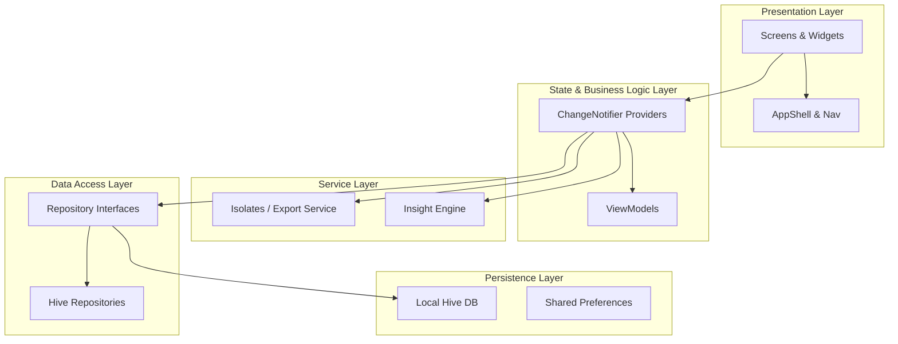

# 1. Project Title
# Budgo — Professional Expense & Financial Management App
An offline-first, high-performance personal finance and expense management application built using Flutter.

**Mission:** Empower individuals to track, budget, and master their daily finances with zero latency, absolute privacy, and stunning design.

---

# 2. Project Overview

**What problem exists?** Traditional financial trackers suffer from bloated network requests, laggy interfaces, and subscription models. They often fail to manage large histories of records over years, leading to stuttering interfaces and memory leaks.
**Why was this application created?** To provide a lightning-fast, offline-first alternative that leverages modern structural architecture and caching techniques.
**What solution does it provide?** Budgo delivers an entirely offline, privacy-focused ledger with advanced budgeting, interactive analytics, wishlist tracking, and automated reminders.
**Who are the intended users?** Freelancers, students, budget-conscious individuals, and privacy advocates.
**What value does it deliver?** Instantaneous financial insights, zero data tracking, and a premium user experience free from delays or ads.

---

# 3. Project Vision

**Future direction:** Budgo aims to become a comprehensive localized financial ecosystem, supporting multi-profile management and localized backups while remaining 100% offline.
**Intended ecosystem:** Core mobile applications on iOS and Android with a potential future desktop extension.
**Long-term impact:** Establish a standard for how privacy-first financial tools should be architected in Flutter.
**Strategic goals:** Support 10+ years of user transaction history without dropping below 60/120 FPS on standard devices.

---

# 4. Problem Statement

**Existing limitations:** Network-reliant apps are slow in low-connectivity areas. Existing offline apps often lack polished UI/UX or crash with large databases.
**User pain points:** Laggy search functions, complex spreadsheet exports, forgotten recurring bills, and difficult budget tracking.
**Market gaps:** A truly premium, aesthetically pleasing, completely free offline ledger built with modern architectural guidelines.
**Technical challenges:** Parsing and querying thousands of NoSQL entries instantly, avoiding UI thread blocking during PDF/CSV exports, and scheduling robust background alarms.

---

# 5. Objectives

- Provide instantaneous UI interactions via custom sliding windows and min-heap algorithms.
- Reduce manual effort by introducing draft-confirm income logic and automatic wishlist conversions.
- Provide intelligent recommendations through an insight engine that translates metrics into human-readable alerts.
- Enable robust offline processing via Isolate-driven thread offloading.

---

# 6. Target Audience

- **End Users:** Individuals wanting granular control over their daily and monthly cash flow.
- **Developers:** Open-source contributors and students looking for an enterprise-level architecture reference in Flutter.
- **Professionals:** Freelancers needing quick, exportable PDF/CSV reports.

---

# 7. Feature Overview

- **Core Module:** Home Dashboard, App Readiness Bootstrap.
- **Ledger Module:** Expenses tracking, Category management, Income drafts.
- **Planning Module:** Wishlist/Future Expenses planner, Budget configurations.
- **Analytics Module:** Reports engine, Fl_Chart integrations, Activity Heatmap.
- **Utilities Module:** Push Notifications, Report Exports, Dynamic Currencies.

---

# 8. Detailed Feature Breakdown

### Robust Expense Ledger
- **Purpose:** Core financial tracking.
- **Functionality:** Add, edit, delete, and categorize expenses instantly.
- **User Interaction:** Bottom sheet forms for quick entry, swipe-to-delete actions on tiles.
- **Technical Implementation:** Backed by Hive; implements an Inverted Prefix Search Index for $O(K \log M)$ search complexity.

### Draft-Confirm Income Workflow
- **Purpose:** Allows users to log expected income before it clears in their bank.
- **Functionality:** Incomes are logged as "pending/draft". Confirming them modifies the active budget snapshot.
- **User Interaction:** Swipe-right on an income tile to confirm it instantly.
- **Technical Implementation:** Managed via `IncomeProvider` coordinating state mutations with the `BudgetProvider`.

### Wishlist Planner
- **Purpose:** Goal setting and future spending preparation.
- **Functionality:** Track items to buy, marking high priority items.
- **User Interaction:** 1-tap conversion of a planned item into an actual ledger expense.
- **Technical Implementation:** Links the newly created expense with the wishlist item's ID for potential rollbacks.

### Smart Budgeting Engine
- **Purpose:** Prevent overspending.
- **Functionality:** Set weekly/monthly limits and view progress bars.
- **User Interaction:** Dashboard widget updates dynamically based on the current threshold.
- **Technical Implementation:** Uses `AlertThrottleService` to track daily warnings, ensuring users aren't spammed with alerts.

### Interactive Analytical Deck
- **Purpose:** Visual financial insights.
- **Functionality:** Pie charts, line trends, and daily heatmaps.
- **User Interaction:** Tap to filter by date ranges; view heatmap intensities for spending velocity.
- **Technical Implementation:** `fl_chart` library driven by `ReportsProvider`, utilizing Top-K Min-Heap algorithms to isolate heavy spending categories rapidly.

### Push Reminders
- **Purpose:** Automate recurring bill notifications.
- **Functionality:** Schedule background alerts for dues.
- **User Interaction:** Set reminders through the UI; interact with "Mark Paid" directly from the OS notification tray.
- **Technical Implementation:** Utilizes `flutter_local_notifications` with inexact `AlarmManager` intents and isolated background handlers safely initializing the Timezone DB in isolated Dart execution contexts.

---

# 9. Application Workflow

1. **Onboarding/Startup:** The app initializes Hive and runs data migrations in `AppInitializer.preInit`, followed by UI readiness in `postInit`.
2. **Dashboard:** The user lands on the Home Screen showing the primary Budget Card, Top 5 Expenses, and quick action FAB.
3. **Transaction Entry:** User taps "+" -> A dynamic bottom sheet slides up -> Inputs amount, title, and category -> Saves.
4. **Analysis:** User navigates to the Reports tab -> Selects a date range -> Views generated charts -> Clicks "Export" to offload PDF generation to an Isolate -> Shares the document natively.
5. **Review:** User checks the Activity tab, uses the prefix search to find an old record, and swipes left to delete it.

---

# 10. Screenshots

> All screens follow a unified Material 3 standard.
<table>
  <tr>
    <td></td>
    <td></td>
    <td></td>
  </tr>
  <tr>
    <td></td>
    <td></td>
    <td></td>
  </tr>
</table>

---

# 11. System Architecture

### Architectural Pattern
Budgo utilizes a **Layered Architecture** built over the **Provider pattern** for state management, loosely combining elements of Clean Architecture for domain separation.

### Layer Breakdown
- **Presentation Layer:** Pure stateless consumption widgets and UI event triggers.
- **State & Logic Layer (Providers):** Central nervous system. `ProxyProviders` handle dependency injection between branches (e.g., BudgetProvider needing IncomeProvider).
- **Service & Utilities Layer:** Distinct singleton services isolating heavy processes (e.g., `ReportExportService` running independent Isolates).
- **Data Access Layer (Repositories):** Interfaces hiding Hive box implementations.
- **Persistence Layer:** Physical binary storage via Hive NoSQL.

---

# 12. Architecture Diagram



---

# 13. Technology Stack

- **Frontend:** Flutter & Dart
- **Backend:** N/A (100% Offline-First)
- **Database:** Hive (NoSQL Key-Value Store)

---

# 14. Development Environment

- **Flutter Version:** `^3.x.x`
- **Dart Version:** `^3.8.1`
- **IDE:** Android Studio / VS Code
- **Operating System:** Cross-platform (Windows / macOS)
- **SDK Requirements:** Android API 33+, iOS 14.0+

---

# 15. Project Structure

- **core/**: Design system tokens, architectural engines, layout constraints, app startup bootstraps.
- **models/**: Type-safe entities (Expense, Budget, Reminder) with Hive TypeAdapters.
- **navigation/**: Routing configuration and transition logic.
- **provider/**: State managers connecting the UI to the Repositories.
- **repositories/**: Abstraction layer over Hive database boxes.
- **screens/**: Page-level Flutter widgets.
- **services/**: Independent processing modules, background isolates, and alert throttling.
- **themes/**: Material 3 light/dark mode properties.
- **widgets/**: Granular components like forms, bottom sheets, buttons, and charts.

---

# 16. State Management Strategy

**Chosen Solution:** `Provider` (`ChangeNotifier`)
**Reason for Selection:** Offers high performance with a low learning curve, fully integrated with Flutter's widget lifecycle.
**Benefits:** Decoupled business logic, easy mocking for testing, `ProxyProvider` enables seamless dependency injections between states.
**Trade-offs:** Can lead to boilerplate `notifyListeners()` calls and lacks the strict event-based tracking of BLoC.

---

# 17. Navigation Architecture

**Navigation Structure:** Uses a centralized `AppShell` with a `BottomNavigationBar` to control primary tabs.
**Routing Strategy:** Constant route strings mapped via `onGenerateRoute` in `MaterialApp`.
**Transitions:** Unified `SharedAxisTransition` from the `animations` package for seamless, modern page changes.
**Route Guards:** Utilizes custom `AppBackGuard` widgets wrapping major data entry screens to trap accidental hardware back button presses.

---

# 18. UI and UX Design System

- **Color System:** Semantic scaling via `Theme.of(context).colorScheme`. No raw hex codes allowed in views.
- **Typography:** `GoogleFonts.roboto` driven by a unified `textTheme` extension.
- **Component Design:** `AppCard`, `AppBudgetCard`, and `AppTransactionTile` follow Material 3 tonal elevation logic.
- **Layout Principles:** Strict constraint tokens from `app_spacing.dart` (`xs: 4`, `sm: 8`, `md: 12`, `base: 16`).
- **Accessibility:** High contrast ratios natively supported by the dynamic Material color themes.

---

# 19. Responsive Design Strategy

**Mobile Layout:** Optimised for standard mobile viewports with flexible bottom sheets spanning edge-to-edge.
**Adaptive Components:** Components utilize `LayoutBuilder` and flexible constraint bounds to stretch efficiently on larger mobile displays.
**Scaling Strategy:** Text scales dynamically with OS-level user preferences.

---

# 20. Data Models

### Expense (`Hive TypeId: 0`)
- **Purpose:** Represents a completed transaction.
- **Fields:** `id`, `amount`, `title`, `category`, `date`, `isExpense`.
- **Validation Rules:** Amounts converted to and validated as minor-units (`int`) to prevent floating-point loss.

### Reminder (`Hive TypeId: 4`)
- **Purpose:** Represents a push notification schedule.
- **Fields:** `id`, `title`, `scheduledAt`, `recurrenceType`, `isActive`.
- **Relationships:** Spawns native `AlarmManager` intents.

---

# 21. Database Design

- **Collections/Boxes:** Independent boxes for Expenses, Incomes, Budgets, Wishlists, and Reminders.
- **Storage Mode:** In-memory mapped files for instantaneous $O(1)$ read cycles.
- **Indexing:** Virtual inverted prefix indexing generated in memory upon startup to prevent locking disk queries.
- **Migration:** Custom `HiveMigration` safety engine validating schema compatibility during `preInit`.

---

# 22. API Architecture

**N/A** - Budgo operates entirely offline to guarantee maximum user data privacy.

---

# 23. Local Storage Strategy

**Primary Engine:** `Hive` (High speed, synchronous synchronous NoSQL store). Used for all relational and primary data points.
**Secondary Engine:** `SharedPreferences`. Used strictly for lightweight primitives: Theme selection, currency configuration, and throttle timestamps.
**Reason:** Hive is significantly faster for structured models, while SharedPreferences is sufficient for unencrypted global toggles.

---

# 24. Data Flow Architecture

```text
User Interface
↓ (Action/Event)
State Management (ChangeNotifier)
↓ (Method Call)
Repository (Interface implementation)
↓ (Atomic Write)
Local Storage (Hive DB)
↓ (Listeners trigger)
State Management (Cache update & notifyListeners)
↓ (Rebuild)
User Interface
```

---

# 25. Third-Party Dependencies

- **`provider`**: Dependency injection and state sharing.
- **`hive` & `hive_flutter`**: Blazing fast NoSQL offline database.
- **`fl_chart`**: Renders highly customizable analytical charts.
- **`flutter_local_notifications`**: Powers the underlying OS-level background intent scheduler for reminders.
- **`pdf` & `printing`**: Used internally by Isolate threads to generate and print report documents.
- **`intl`**: Currency formatting and localization rules.

---

# 26. External Integrations

- N/A (Fully Offline App). Native integrations include local file sharing bridging (via `share_plus`).

---

# 27. Security Architecture

- **Offline Isolation:** Data never leaves the physical device. Zero network vectors for data exfiltration.
- **File System Protection:** Hive boxes are stored in the application's secure documents directory, impenetrable to other apps on unmodified OS environments.
- **Input Validation:** Numeric string parsers validate length limits (e.g. ₹10,00,000 max) before saving binary states.

---

# 28. Error Handling Strategy

- **Runtime Exceptions:** Wrapped in isolated `try/catch` blocks.
- **Concurrency Errors:** Eradicated via the custom `AtomicWriter` reentrant mutex zone queue preventing file locks.
- **Background Isolates:** If an isolated PDF generation fails, a distinct error payload returns through the `SendPort`, displaying a clean SnackBar to the user.
- **Logging Strategy:** Internal `JobRecord` persistent tracking saves failed actions for subsequent startup reconciliation.

---

# 29. Performance Optimization

- **Custom Sliding Viewport:** Only the nearest 100 widgets are inflated into memory during deep scroll sessions via `advanceWindow()`.
- **Top-K Min-Heap:** Limits database sorting latency by isolating top expenses in $O(N \log K)$ runtime.
- **Isolate Offloading:** Heavy serialization (PDF/CSV) runs on separate OS threads to prevent 60FPS UI jank.
- **Prefix Search Indexes:** Pre-calculates search queries preventing full-database regex matching.

---

# 30. Offline Functionality

Budgo is a fundamentally offline platform.
- **Data Caching:** Everything is stored durably via Hive.
- **Synchronization:** N/A natively, preventing sync conflict edge cases.

---

# 31. Testing Strategy

- **Unit Testing:** Validates algorithms, state transitions, reminder schedulers, and minor-unit monetary math.
- **Widget Testing:** Validates specific `ChangeNotifier` triggers and layout guards (`AppBackGuard`).
- **Command:** Validated via `flutter test`. Full green suite confirming zero regressions across the `Provider` layer.

---

# 32. Scalability Considerations

- **Modular Design:** Layers are fully isolated. Moving from Hive to SQLite or Realm would only require rewriting the Repository interfaces.
- **Feature Expansion:** Using Provider proxies allows infinite feature depth without polluting the root state graph.

---

# 33. Key Learnings

- **Flutter Architecture:** Properly isolating presentation from domain logic drastically reduces bug velocity.
- **Isolates:** Background processing is vital for offline apps handling thousands of rows; UI stutters are completely preventable.
- **Native Android Binding:** Background intents require careful manifest configuration (like `ScheduledNotificationReceiver`) and strict memory initialization protocols when returning to Dart.

---

# 34. Future Roadmap

**Short-Term Goals:** Expand the dynamic currency system with automatic locale detection.
**Mid-Term Goals:** Build an automated encrypted Google Drive / iCloud backup bridge.
**Long-Term Goals:** Expand the ecosystem with a native MacOS / Windows desktop client sharing the same offline Hive structure.

---

# 35. Setup Instructions

The latest application binaries are available in the GitHub Releases section. 

### Local Installation
1. Clone the repository: `git clone https://github.com/2005-rafi/budgo.git`
2. Navigate to directory: `cd expense`
3. Fetch dependencies: `flutter pub get`
4. Run code generation (optional): `flutter pub run build_runner build --delete-conflicting-outputs`
5. Boot application: `flutter run`

---

# 36. Configuration Guide

- **Environment Variables:** None required.
- **Firebase Setup:** N/A.

---

# 37. Build Instructions

**Android APK:** `flutter build apk --release`
**Android App Bundle (AAB):** `flutter build appbundle --release --obfuscate --split-debug-info=build/debug-info`
**iOS Build:** `flutter build ipa --release`

---

# 38. Deployment Guide

- Built using GitHub actions.
- Semantic Versioning Strategy dictates tags (`v1.0.0`).
- Released directly to the GitHub releases page as `app-release.apk`.

---

# 39. Contributing Guidelines

- **Branch Strategy:** Fork and create feature branches (`feature/add-dark-mode`).
- **Commit Standards:** Prefer conventional commits (e.g. `feat: xyz`, `fix: abc`).
- **Pull Request Workflow:** PRs must pass `flutter analyze` and `flutter test`.

---

# 40. License

Standard open-source usage rights. (See `LICENSE` file if included).

---

# 41. Author Information

- **Name:** Rafi
- **GitHub:** [2005-rafi](https://github.com/2005-rafi)

---

# 42. Acknowledgements

- The Flutter & Dart core team.
- Maintainers of `hive`, `provider`, and `fl_chart`.
- Material 3 Design System documentation.

---
